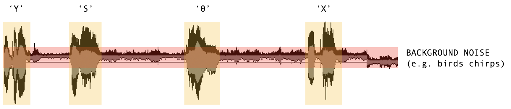
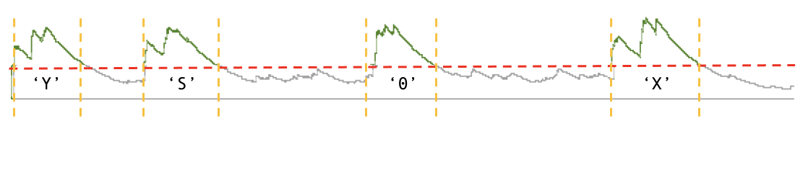
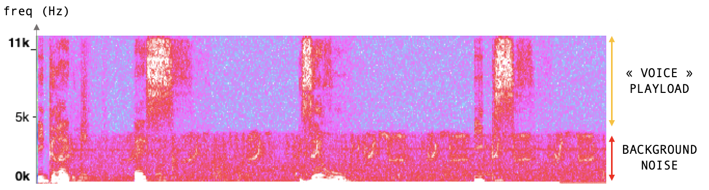
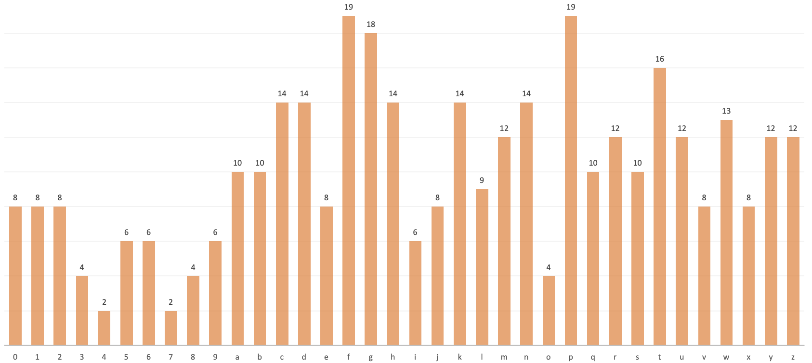

# Voice Reverse Captcha

Creating an algorithm that solves an image-based captcha (*sequence of letters or numbers in a distorted image*) is a big deal and requires some brain-power to crack it.

Let's try to do this using audio captchas some websites thankfully offers as an alternative for people with visual impairment.

**Pure Node.js**. No deep-dark machine-learning stuff.

This repository shows how to solve audio captchas from https://teleservices.paris.fr/rdvtitres/JCaptchaSound.

> Use it for education purpose only, at your own risk.

> Skip to [Installation](#install) if you don't want to read the boring theoretical part below

## How it works

Let's have a look at the WAV file signal along time.
We then can visually identify parts of the audio track that are the spoken letters, plus a background noise which purpose is to prevent reverse detection (mmh).



We can perform a peak detection (the same way it is done in a [RC+Diode circuit](https://www.allaboutcircuits.com/textbook/semiconductors/chpt-3/peak-detector/)) to help us split the WAV track into chunks. Then, we'll add a threshold so we can identify letters blocks.



> This is a coarse explanation. In fact, in french, some spoken letters are treated as two chunks (*e.g. "Y" is [igʁɛk] or « i-grec »*). The split algorithm implementation will search for any near chunk and merge those two together if close enough in the WAV track.

Because noise is not a constant waveform, we also need to remove it from the chunks or perform analysis only on the voice frequencies. Here come the FFT (*Fast Fourier Transform*) data plotted along time.



Thanks for us, the voice used to generate the captcha uses higher frequencies than the background noise.

Now, we can *train* / create a database where each letter chunk frequencies along time are stored with their relative values. The more chunks we have the better is, since the noise removal procedure is not perfect.

A good entropy would look like a perfect repartition among all letters and numbers (which is not the same below, that would skew the final results...)



Reverse captcha would do the same as written before, and perform distance calculation for each freshly identified chunk's frequencies levels. And you're done.

## Capabilities

Limited to the `0123456789abcdefghijklmnopqrstuvwxyz` subset, or even less since some characters voices are not present *enought* in the given database.

## Performances

Takes **less than 2 seconds** on a 2017 i5 MacBook with the current 70MiB database.

## Requirements

- Node.js 14

## Install

```bash
git clone https://github.com/rascafr/voice-reverse-captcha.git
cd voice-reverse-captcha
npm i
```

## Usage

> Warning, some folders are ignored from the git tracking systems so you might have to create them by yourself.

- `audio_download_batch.js` downloads a set of audio captchas from the teleservice app
- `audio_split_detection.js` perform analysis on downloaded audio captchas and splits them into chunks you can use for training later
- `audio_entropy.js` checks the entropy of the downloaded and splitted wav files
- `audio_analysis.js` performs some analysis, displays in nodeplotlib FFT and WAV signals
- `audio_create_db.js` create the huge database depending of your trained WAV chunks files and entropy
- `audio_reverse_captcha.js` does the main job.

## Proof-of-concept

```bash
node src/audio_reverse_captcha.js yourFile.wav
# Captcha resolved! " xyz123 "
```

## Thanks to

- https://www.npmjs.com/package/fft.js
- https://www.npmjs.com/package/node-wav
- https://www.npmjs.com/package/nodeplotlib (awesome plotting library, inspired by *matplotlib* in Python)